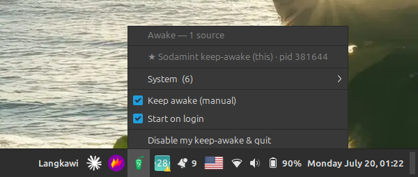

<p align="center">
  
</p>

# Sodamint: keeping Linux awake for overnight agent runs

I was surprised that the ready-made keep-awake tools don't work on Linux Mint.
When you run long agent sessions it really matters that the machine doesn't fall
asleep in the middle. I often put Codex and Claude-Code overnight to implement
epics I create with [Epic-Loop](https://github.com/usulpro/epic-loop), and
finding out the computer slept somewhere in the middle means losing 3-4 hours of
work. I tried caffeine, it didn't save me. I decided that building a small
working thing together with Claude-Code would be an easy evening.

Later it turned out that Ubuntu based distros already have a good native service
for this (I use Linux Mint and Kubuntu): systemd-logind, which keeps a registry
of every process asking the machine to stay awake. The real task was only to put
a UI on top of it and package it as a small system app in a .deb, no new engine
to write.

What Sodamint does: it holds one logind inhibitor while you keep it on, so the
machine stays awake at the right layer (this is why the old screensaver tricks
fail, they poke the wrong thing). The tray icon lights up whenever something is
actually holding the machine awake, not only your own lock. The menu lists every
source read straight from logind: who set it and why, plus the pid.

<!-- Oleg: drop the tray-menu screenshot here as blog/sodamint-tray-menu.png -->


The part that makes it handy for long agent sessions is a small contract for
showing locks in that menu. An agent keeps the machine awake by taking its own
lock and tagging it with who=sodamint-agent, and Sodamint highlights those rows.
The point is to let agents talk to the service themselves and handle their own
sleep problem, less human factor and fewer failures. You still open the menu and
confirm that the running agent set the lock, so nothing is hidden.

The rest is minimal on purpose: a manual toggle and a Start on login option.
Quit drops only your own lock and leaves the agents running. External locks are
read-only, Sodamint never kills someone else's lock, it only shows it.

The whole app is one Python file, GTK3 tray, no daemon, no pip. Install is a
single .deb, and apt pulls the dependencies:

```bash
sudo apt install ./sodamint_1.0.0_all.deb
```

It's on GitHub at [usulpro/sodamint](https://github.com/usulpro/sodamint). Open
an issue if it breaks on your setup.
